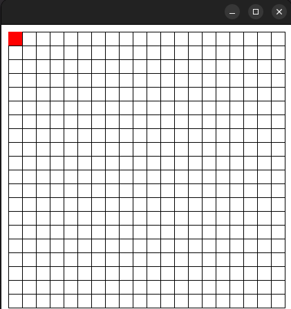
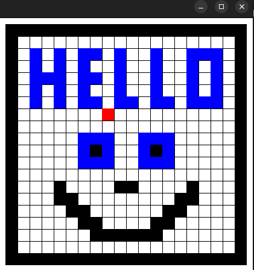

# Simple Java Painting Program

This Java program implements a basic painting application where users can draw on a grid using a "painter" (represented by a red rectangle).

## Features

### Drawing on a Grid:
- The program creates a grid of cells where users can draw.
- Each cell can be painted **black**, **blue**, or erased (set to white).

### Painter Control:
- Users control the painter using **arrow keys** to move it around the grid.

### Painting Functionality:
- **Paint a cell black:** Press `Z` key.
- **Erase a cell:** Press `Spacebar`.
- **Paint a cell blue:** Press `X` key.

### Saving and Loading:
- **Save the current grid state:** Press `S` key.
- **Load a saved grid state:** Press `L` key.

### Clearing the Grid:
- **Clear the entire grid:** Press `C` key.

---

## Code Structure

- **`Cells.java`:** Defines a `Cells` class representing individual cells on the grid.
- **`Painter.java`:** Defines a `Painter` class representing the drawing tool.
- **`Grid.java`:** Defines a `Grid` class representing the grid structure.
- **`MyKeyboardHandler.java`:** Defines a `MyKeyboardHandler` class for handling keyboard events.

---
## Pictures

---

## Possible Enhancements

- **Color Selection:** Implement a wider range of colors for users to choose from.
- **Undo/Redo Functionality:** Add the ability to undo and redo actions.
- **Zoom:** Allow users to zoom in and out on the grid.
- **Drawing Tools:** Implement additional drawing tools (lines, circles, etc.).
- **Graphical User Interface:** Create a more user-friendly graphical interface instead of using keyboard input.

---

**Enjoy painting!**
